# Paleo Workbench 架构深度审查报告 (Architecture Review)

## 1. 架构总览与系统定位

Paleo Workbench 是一款面向古地理图编制、多源地质数据协同分析、单井/连井测井解释、三维地震解译以及智能岩相古地理制图的工业级桌面工作台。系统融合了 C++ 高性能计算内核、PySide6 桌面交互层、QGIS 开源制图生态以及 AI/启发式预测引擎。

```mermaid
graph TD
    subgraph UI_Layer ["桌面 UI 层 (PySide6 / Qt6)"]
        MainWindow["PaleoWorkbenchWindow (主窗口 / 导航)"]
        DataPage["DataPage (数据管理与资产预览)"]
        WellLogPage["WellLogPage (单井/连井测井绘图)"]
        SeismicPage["SeismicPage (三维地震与正交切片)"]
        SingleFactorPage["SingleFactorPage (单因素图编制)"]
        MapAuthoringPage["MapAuthoringPage (统一制图画布与拓扑编辑)"]
        PredictionPage["PredictionPage (智能岩相预测)"]
        WorkflowPanel["WorkflowStepper (工序流程导航)"]
    end

    subgraph Service_Layer ["核心服务与业务层 (Headless Pure Python)"]
        DataCatalogService["DataCatalogService (资产全生命周期/CAS存储)"]
        WorkflowService["WorkflowService (工作流证据链与状态推断)"]
        InferenceService["InferenceService (模型注册与预测调度)"]
        GeometryService["GeometryService (空间几何与拓扑服务)"]
        DataAssetRegistry["DataAssetRegistry (文件格式/IO解析注册)"]
        MapRenderBackend["MapRenderBackend (渲染器中立切片与组合)"]
    end

    subgraph Native_Layer ["高性能 C++ 本地计算内核 (pybind11)"]
        SeismicCore["seismic_3d_core (切片提取/相干/等值面)"]
        WellLogCore["well_log_core (4点Min-Max降采样/LAS解析)"]
        MapEditCore["map_edit_core (拓扑捕捉/空间索引)"]
        GridRenderCore["grid_render_core (标量场光栅化/色标渲染)"]
        QgisBridge["qgis_render_bridge (QGIS C++ 符号渲染桥接)"]
    end

    subgraph Storage_Layer ["存储与外部资产 (CAS & Master)"]
        CatalogJSON["catalog.json (Canonical Master)"]
        CatalogDB["catalog.sqlite (Rebuildable Index)"]
        CASPayloads[".artifacts/{raw,derived,outputs}/ (不可变载荷)"]
        GeoVizEngine["geo-viz-engine / well-log-engine (底层引擎)"]
    end

    UI_Layer --> Service_Layer
    Service_Layer --> Native_Layer
    Service_Layer --> Storage_Layer
    Native_Layer --> Storage_Layer
```

---

## 2. 模块边界与子系统分析

### 2.1 目录组织与模块职责

| 模块路径 | 代码规模 | 核心职责 | 边界清晰度 |
|---|---|---|---|
| `paleo_workbench/catalog` | 25 files / 10,422 lines | 数据资产全生命周期管理（RAW/DERIVED/INTERMEDIATE/OUTPUT）、CAS 内容寻址存储、不可变版本链、数据血缘图（LineageGraph）、垃圾回收与合规审计。 | 优秀 (遵循 ADR 0056，单写入口) |
| `paleo_workbench/mapping` | 18 files / 5,852 lines | 统一制图画布、矢量图层数据结构、拓扑编辑与校验（FeatureEditor）、QGIS 样式编码器与 Fallback/QGIS 双渲染后端。 | 良好 (渲染与状态解耦清晰) |
| `paleo_workbench/viz` | 61 files / 12,154 lines | 地震三维视图、正交切片联动、井震联合三维剖面、连井对比地层基准面（WellSectionDatum）、DTW 井间曲线对齐、地层三维网格构建。 | 良好 (算法与适配器分层明确) |
| `paleo_workbench/workflow` | 37 files / 12,447 lines | 8步业务工序编排（数据准备→层序格架→单因素图→智能预测→综合编图→成果质检）、证据链与新鲜度计算、单因素约束 IDW 适配器。 | 良好 (状态与证据驱动) |
| `paleo_workbench/prediction` | 8 files / 2,175 lines | 模型注册表（ModelRegistry）、纯 Python 无框架绑定的推理调度（InferenceService）、Demo/Heuristic Facies 适配器。 | 中等 (缺少大模型/AI Agent 接入层) |
| `paleo_workbench/resources` | 17 files / 3,775 lines | 格式规范注册（FormatSpec）、文件探测与分类、表格/文本/图片/GeoTIFF/LAS 多格式预览解析器与导出器。 | 良好 |
| `paleo_workbench/project` | 9 files / 3,094 lines | 工程文档定义（ProjectDocument）、Pydantic 数据模型、工程生命周期管理与文件路径规则。 | 良好 |
| `paleo_workbench/ui` | 143 files / 40,593 lines | Qt 桌面 UI 实现，包括页面（Pages）、组件（Widgets）、设计规范（Tokens）、样式表（QSS）、事件总线与异步 Worker。 | 中等 (存在部分 UI 与业务状态强耦合) |
| `paleo_workbench/_vendored` | 9 files / 11,591 lines | 从 `haiyou-visualization` 裁剪集成的约束 IDW 插值、各向异性方向廊道、断层遮挡与网格计算纯算法模块。 | 优秀 (零 GUI 污染，纯 NumPy) |
| `native/` | 28 files / 4,887 lines | pybind11 C++ 原生扩展（`seismic_3d_core`、`well_log_core`、`grid_render_core`、`layer_model_core`、`qgis_render_bridge`）。 | 优秀 (具备纯 Python 对称回退) |

---

## 3. 数据流与服务调用关系

### 3.1 数据生命周期流转
1. **数据摄入 (Ingestion)**:
   - 外部文件通过 `DataAssetRegistry.inspect` 进行格式识别与元数据提取。
   - `DataCatalogService.import_raw` 执行单遍 Hash-while-copy，将原始文件置入 `<project>.artifacts/raw/{asset_id}/{version_id}/`，设置文件为只读并记录 SHA-256。
   - 更新 Canonical Store `catalog.json`，异步增量写入 `catalog.sqlite` 索引。

2. **工序驱动与计算 (Workflow & Processing)**:
   - 各业务页面读取 `WorkflowService.home_workflow_steps` 计算当前步骤状态（未开始、进行中、已完成、失效）。
   - 单因素图计算：`factor_interpolation.py` 调度 `haiyou_constrained_idw` 核心，生成标量网格矩阵并由 `DataCatalogService.register_output` 登记为 DERIVED 资产。
   - 地层对比与 DTW 对齐：`stratigraphic_correlation_engine.py` 驱动 `DTWLogMatcher` 计算井间曲线映射路径，生成解释快照。

3. **地图渲染与交互 (Mapping & Rendering)**:
   - 制图画布维护不可变图层快照 `MapRenderSnapshot`。
   - `MapRenderBackend` 将快照分发至 `FallbackMapRenderBackend` (QPainter 多线程渲染) 或 `QgisMapRenderBackend` (QGIS C++ 引擎)。
   - 编辑器 `FeatureEditor` 在用户拖拽顶点时执行拓扑规则校验（自相交检查、公共边吸附、拓扑回滚机制），确保几何合法性。

---

## 4. 前后端与多技术栈架构关系

### 4.1 C++ / Python 对称性架构 (Symmetric Parity Contract)
系统严格遵循 ADR 规范中的对称性契约：
- 所有 C++ 扩展（如 4点 Min-Max 降采样、正交切片提取、3D 相干计算、Marching Tetrahedra 等值面）均在 `native_backend.py` 中实现了 **100% 纯 Python 回退算法**。
- 提供 `with native_backend.disabled_acceleration():` 上下文管理器，允许测试套件和无 C++ 编译环境的轻量运行时无缝运行。

### 4.2 桌面端 (Qt) 与 无头服务 (Headless) 边界
- **无头服务层**: `catalog`、`workflow/contracts`、`prediction`、`mapping/document_io` 均为纯 Python / Qt-free 设计，可直接在 CLI 或自动化管道中运行。
- **UI 绑定层**: 位于 `paleo_workbench/ui/`，通过 Qt 信号槽机制消费底层服务，使用 Worker 线程隔离耗时计算，避免阻塞主事件循环。

---

## 5. 关键架构瓶颈与缺陷发现

1. **AI Agent 接入困难与 Harness 缺失 (P1)**:
   - 当前 `prediction/` 仅支持静态的 `ModelProvider` 接口，缺乏面向 LLM / 智能体的 **Tool Registry**、**Skill Registry** 与 **Task Graph 编排引擎**。
   - AI Agent 无法通过标准化、类型安全的 RPC/函数调用接口控制数据摄入、空间分析、单因素制图和地图渲染。

2. **UI 逻辑与数据状态的局部耦合 (P2)**:
   - 部分复杂页面（如 `composite_visualization_panel.py` 和 `map_authoring_page.py`）存在直接持有多个子 Widget 状态并手动派发事件的情况，缺少统一的 UI State Store / Command Pattern。

3. **QGIS 深度融合尚存割裂 (P1)**:
   - QGIS 渲染桥 (`qgis_render_bridge`) 目前属于可选编译项（Opt-in），Fallback 渲染器与 QGIS 渲染器在高级标注引擎（Labeling Engine）、复杂规则渲染（Rule-based Symbol）及打印布局（Print Layout Composer）上存在表现差异。

4. **单因素图与地图制图管线尚未完全合流 (P2)**:
   - `_vendored/haiyou_constrained_idw` 输出的标量网格（Scalar Grid）与 `mapping/vector_layer.py` 之间需经过多重适配器转换，缺少统一的 GeoRasterLayer / ContinuousFieldSymbol 管道。

---

## 6. 架构优化与重构建议

1. **构建 Paleo AI GIS Harness**:
   - 在 `paleo_workbench/agent/` 下建立统一的 Agent Harness，提供 `IntentParser`、`TaskGraphPlanner`、`ToolRegistry` 以及 `Data/GIS/Well/Seismic/Mapping/QA` 领域 Agent。
2. **统一 GIS 图层与符号系统 (Unified Symbology Pipeline)**:
   - 抽象 `RasterLayerRenderer` 与 `VectorLayerRenderer`，将单因素等值面渲染、连续色阶着色与 QGIS 符号树彻底归一。
3. **引入 Map Composer 布局引擎**:
   - 建立声明式 `MapTemplate` 数据结构，将主图、图例、指北针、比例尺、网格、图名与地质年表标注规范化。
