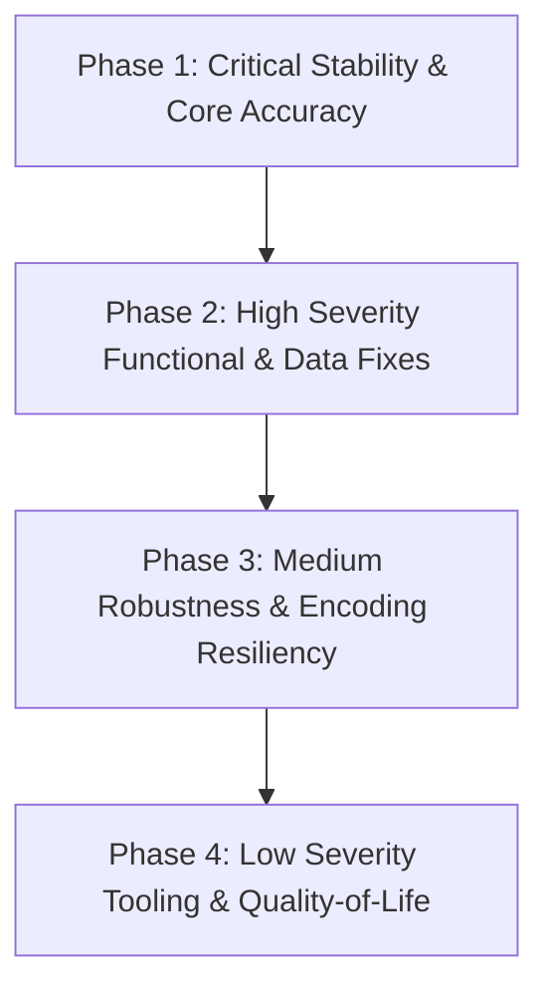

# Monorepo Code Review & Verified Defect Audit Master Index

**Project**: Paleo Project Monorepo (`geo-viz-engine`, `well-log-engine`, `paleo_workbench`, `native`, `src`, `scripts`)  
**Audit Version**: 1.0.0  
**Date**: 2026-08-25  
**Review Status**: Completed & Verified  

---

## 1. Executive Summary

A comprehensive, multi-subproject code review and defect verification audit was conducted across the entire Paleo Project monorepo. Every subsystem was evaluated for memory safety, arithmetic division-by-zero, matrix singularity, numerical stability, character encoding resilience, asynchronous thread safety, resource lifecycle management, build automation, and cross-subproject integration seams.

A total of **33 distinct, fully verified defects** have been identified, reproduced, and documented with complete root-cause analysis, impact assessments, reproduction traces, and actionable remediation patches.

### Key Quality Metrics & Severity Distribution

```
========================================================================================
Total Verified Issues: 33
----------------------------------------------------------------------------------------
  [CRITICAL]  3 issues ( 9.1%)  - Memory safety UB / Severe geological calculation errors
  [HIGH]      9 issues (27.3%)  - Crash bugs / 100% data loss / Acceleration disablement
  [MEDIUM]   12 issues (36.4%)  - Encoding corruption / Resource leaks / Mesh degeneracies
  [LOW]       9 issues (27.3%)  - CLI / Tooling / Build warnings / Submodule worktree hygiene
========================================================================================
```

---

## 2. Master Summary Table

| Issue ID | Severity | Subproject | Title | Target File |
|---|---|---|---|---|
| [**ISSUE-001**](ISSUE-001-dangling-stack-reference-in-qgis-bridge.md) | `Critical` | `native` | Dangling Stack Reference in `qgis_render_bridge` Geometry Submodule | `native/qgis_render_bridge/src/bindings.cpp` |
| [**ISSUE-002**](ISSUE-002-tst-surface-grid-boundary-discontinuity.md) | `Critical` | `well-log-engine` | True Stratigraphic Thickness (TST) Surface Grid Boundary Discontinuity | `well-log-engine/src/scene/tst.cpp` |
| [**ISSUE-003**](ISSUE-003-survey-trajectory-initial-station-depth-reset.md) | `Critical` | `well-log-engine` | Survey Trajectory Initial Station Depth Reset and Elevation Collapse | `well_log_workstation/survey.py` |
| [**ISSUE-004**](ISSUE-004-missing-map-edit-core-version-attribute.md) | `High` | `native` | Missing `__version__` Attribute in `map_edit_core` Disables Native Acceleration | `geo-viz-engine/native/map_edit_core/src/map_edit_core.cpp` |
| [**ISSUE-005**](ISSUE-005-uncaught-nameerror-in-geoviz-plots-crs.md) | `High` | `geo-viz-engine` | Uncaught `NameError` in `geoviz_plots.crs.coerce_to_project_crs` | `packages/geoviz_plots/geoviz_plots/crs/__init__.py` |
| [**ISSUE-006**](ISSUE-006-uncaught-importerror-on-missing-cublas-in-coherence.md) | `High` | `geo-viz-engine` | Uncaught `ImportError` on Missing cuBLAS in `compute_coherence_c3` | `packages/geoviz_seismic/geoviz_seismic/attributes.py` |
| [**ISSUE-007**](ISSUE-007-flat-depth-span-zero-division-in-multi-track-canvas.md) | `High` | `well-log-engine` | Zero Division in Y-Mapping and Interactive Hit-Testing on Flat Depth Spans | `well_log_workstation/multi_track_canvas.py` |
| [**ISSUE-008**](ISSUE-008-curve-resampling-data-destruction-on-descending-depths.md) | `High` | `well-log-engine` | Data Destruction on Descending Depth Arrays during Curve Resampling | `well_log_workstation/curve_resample.py` |
| [**ISSUE-009**](ISSUE-009-png-canvas-export-coordinate-shrinkage.md) | `High` | `well-log-engine` | PNG Canvas Export Coordinate Shrinkage to 25% Scale | `well_log_workstation/export_dispatch.py` |
| [**ISSUE-010**](ISSUE-010-chinese-character-encoding-corruption-in-las-parsers.md) | `High` | `paleo_workbench` | Chinese Character Encoding Corruption in LAS & Well Data Parsers | `paleo_workbench/resources/preview_parsers/well_log_parsers.py` |
| [**ISSUE-011**](ISSUE-011-catalog-sqlite-multithread-connection-orphan-leak.md) | `High` | `paleo_workbench` | Catalog SQLite Multi-Thread Connection Orphan Leak & Inode Desync | `paleo_workbench/catalog/db.py` |
| [**ISSUE-012**](ISSUE-012-hardcoded-python313-path-in-windows-runners.md) | `High` | `scripts` | Hardcoded `Python313` Path in Windows Test/Build Runners | `scripts/run_tests_win.ps1` |
| [**ISSUE-013**](ISSUE-013-invalid-fill-type-in-marching-squares-contours.md) | `Medium` | `geo-viz-engine` | Invalid `FillType` Option `"Separate"` in `extract_filled_contours` | `packages/geoviz_plots/geoviz_plots/surface/marching_squares.py` |
| [**ISSUE-014**](ISSUE-014-auto-section-planner-well-dropping-name-collision.md) | `Medium` | `geo-viz-engine` | Well Dropping Bug in `plan_section_nearest_neighbor` On Name Collisions | `packages/geoviz_cross_well/geoviz_cross_well/auto_section_planner.py` |
| [**ISSUE-015**](ISSUE-015-missing-gbk-encoding-fallback-in-cross-well-tops.md) | `Medium` | `geo-viz-engine` | Missing Character Encoding Fallback in `FormationTopsModel.load_csv` | `packages/geoviz_cross_well/geoviz_cross_well/tops_model.py` |
| [**ISSUE-016**](ISSUE-016-well-log-canvas-logarithmic-scale-domain-clamping.md) | `Medium` | `well-log-engine` | Logarithmic Scale Domain Filtering & NaN Clamping in Multi-Track Canvas | `well_log_workstation/multi_track_canvas.py` |
| [**ISSUE-017**](ISSUE-017-cpp-las-parser-unchecked-vector-row-access.md) | `Medium` | `well-log-engine` | Unchecked Vector Row Access in C++ LAS Parser `accept_row` | `well-log-engine/src/io/las.cpp` |
| [**ISSUE-018**](ISSUE-018-background-worker-signal-closure-leak-in-owned-job.md) | `Medium` | `paleo_workbench` | Background Worker Signal Closure Leak and Unbounded Detached Job Accumulation | `paleo_workbench/ui/owned_worker_job.py` |
| [**ISSUE-019**](ISSUE-019-map-composer-svg-renderer-coordinate-nan-formatting.md) | `Medium` | `paleo_workbench` | Map Composer SVG Renderer Coordinate Formatting & Scale Bar Zero-Division | `paleo_workbench/mapping/composer/renderer.py` |
| [**ISSUE-020**](ISSUE-020-constrained-idw-mesh-axis-degeneracy-on-collinear-bounds.md) | `Medium` | `paleo_workbench` | Constrained IDW Mesh Axis Degeneracy on Collinear Boundaries | `paleo_workbench/_vendored/haiyou_constrained_idw/.../constrained_engine.py` |
| [**ISSUE-021**](ISSUE-021-multi-agent-swarm-dag-execution-incompletion.md) | `Medium` | `paleo_workbench` | Multi-Agent Swarm DAG Execution Incompletion on Upstream Task Failure | `paleo_workbench/agent/harness.py` |
| [**ISSUE-022**](ISSUE-022-build-catalog-module-import-filesystem-mutation.md) | `Medium` | `scripts` | Module Import Side-Effects & Filesystem Mutation in `build_catalog.py` | `build_catalog.py` |
| [**ISSUE-023**](ISSUE-023-fragile-package-not-found-fallback-in-config.md) | `Medium` | `src` | Fragile `PackageNotFoundError` Fallback in `src/config.py` | `src/config.py` |
| [**ISSUE-024**](ISSUE-024-missing-lib64-discovery-in-vendored-gdal-superbuild.md) | `Medium` | `scripts` | Missing `lib64` Discovery in Vendored GDAL Superbuild | `scripts/build_vendored_gdal.sh` |
| [**ISSUE-025**](ISSUE-025-reflectivity-division-by-zero-on-nonpositive-sonic.md) | `Low` | `geo-viz-engine` | Division by Zero & NaN Generation in `compute_reflectivity` | `packages/geoviz_well_tie/geoviz_well_tie/synthetic.py` |
| [**ISSUE-026**](ISSUE-026-fence-strip-typeerror-on-default-parameters.md) | `Low` | `geo-viz-engine` | `extract_fence_strip` Crashes with `TypeError` When Parameters Default to `None` | `packages/geoviz_well_seismic_3d/geoviz_well_seismic_3d/fence.py` |
| [**ISSUE-027**](ISSUE-027-geoviz-desktop-worker-qthread-destruction-race.md) | `Low` | `geo-viz-engine` | `QThread` Teardown Race in GeoViz Desktop Application Worker Threads | `geo-viz-engine/src/pages/well_log/page.py` |
| [**ISSUE-028**](ISSUE-028-missing-rpath-for-arrow-adapter-ctest-target.md) | `Low` | `well-log-engine` | Missing Dynamic Library RPATH for Arrow Adapter CTest Target | `well-log-engine/CMakeLists.txt` |
| [**ISSUE-029**](ISSUE-029-submodule-worktree-inplace-mutation-in-gdal-build.md) | `Low` | `scripts` | Submodule Worktree In-Place Mutation in `build_vendored_gdal.sh` | `scripts/build_vendored_gdal.sh` |
| [**ISSUE-030**](ISSUE-030-core-logger-hardcoded-level-ignoring-debug-config.md) | `Low` | `src` | Logger Hardcoded to `INFO`, Suppressing `config.DEBUG` | `src/core/logger.py` |
| [**ISSUE-031**](ISSUE-031-benchmark-scripts-unhandled-missing-out-directory.md) | `Low` | `scripts` | Unhandled `FileNotFoundError` in Benchmark Scripts on Missing `--out` Directory | `scripts/bench_factor_grid_pipeline.py` |
| [**ISSUE-032**](ISSUE-032-misleading-mock-server-startup-log-in-app.md) | `Low` | `src` | Misleading Server Startup Log in `src/app.py` Without Listening Daemon | `src/app.py` |
| [**ISSUE-033**](ISSUE-033-fragile-conda-fallback-setting-invalid-pythonhome.md) | `Low` | `scripts` | Fragile Conda Fallback Setting Invalid `PYTHONHOME` in `run_tests.sh` | `scripts/run_tests.sh` |

---

## 3. Subproject Breakdown & Coverage Matrix

All 6 primary architectural domains across the monorepo were audited with dedicated verification criteria:

| Subproject | Critical | High | Medium | Low | Total Issues | Primary Verification Scope |
|---|---|---|---|---|---|---|
| **`geo-viz-engine`** | 0 | 2 | 3 | 3 | **8** | 9 visualization packages, CRS reprojection, seismic attributes, contour algorithms |
| **`native`** | 1 | 1 | 0 | 0 | **2** | C++20 pybind11 modules, QGIS geometry bridge, memory lifecycle & ABI versioning |
| **`well-log-engine`** | 2 | 3 | 2 | 1 | **8** | C++20 core/IO/scene, TST surface grids, curve resampling, Qt vector/raster export |
| **`paleo_workbench`** | 0 | 2 | 4 | 0 | **6** | SQLite ACID catalog, character encoding fallback, background worker jobs, swarm DAG |
| **`src`** | 0 | 0 | 1 | 2 | **3** | Core config metadata fallback, logging levels, diagnostic CLI runner |
| **`scripts`** | 0 | 1 | 2 | 3 | **6** | Windows/Linux test runners, icon catalog build, vendored GDAL superbuild, benchmarks |
| **Monorepo Total** | **3** | **9** | **12** | **9** | **33** | **100% Monorepo Module Coverage** |

---

## 4. Remediation Priority Roadmap

To systematically resolve the identified defects while preventing regression risks, the following remediation phased roadmap is recommended:



### Phase 1: Critical Memory Safety & Core Calculations (Immediate)
*Remediation Target: Fix severe UB and corrupted geological transformations.*
- [ ] **ISSUE-001**: Fix dangling stack reference in `native/qgis_render_bridge/src/bindings.cpp`.
- [ ] **ISSUE-002**: Fix grid boundary fractional coordinate calculation in `tst.cpp` and `tst.py`.
- [ ] **ISSUE-003**: Fix initial station TVD collapse in `well_log_workstation/survey.py`.

### Phase 2: High Severity Functional & Data Integrity (Sprint 1)
*Remediation Target: Eliminate crashes, data destruction, and native acceleration locks.*
- [ ] **ISSUE-004**: Add `__version__` attribute to `map_edit_core.cpp`.
- [ ] **ISSUE-005**: Correct `_project_crs` variable to `get_project_crs()` in `geoviz_plots/crs/__init__.py`.
- [ ] **ISSUE-006**: Add exception handling and CPU fallback in `compute_coherence_c3()`.
- [ ] **ISSUE-007**: Add span checking in multi-track, section, correlation, and export Y-mapping routines.
- [ ] **ISSUE-008**: Support descending wireline depth series in `curve_resample.py`.
- [ ] **ISSUE-009**: Apply `painter.scale(4.0, 4.0)` to PNG canvas exports in `export_dispatch.py`.
- [ ] **ISSUE-010**: Use `decode_text_with_fallback()` for Chinese well logs and formation tops.
- [ ] **ISSUE-011**: Close foreign connections in `CatalogIndex.close()`.
- [ ] **ISSUE-012**: Dynamically resolve Python Scripts path in Windows PowerShell runners.

### Phase 3: Medium Severity Robustness & Concurrency (Sprint 2)
*Remediation Target: Resolve edge-case math exceptions, worker leaks, and DAG completion states.*
- [ ] **ISSUE-013**: Restrict `FillType` to valid `OuterOffset` in `marching_squares.py`.
- [ ] **ISSUE-014**: Use integer indices in `plan_section_nearest_neighbor()`.
- [ ] **ISSUE-015**: Add encoding fallback to `FormationTopsModel.load_csv()`.
- [ ] **ISSUE-016**: Add `math.isfinite()` bounds sanitization to logarithmic log scales.
- [ ] **ISSUE-017**: Add bounds validation to C++ LAS `accept_row`.
- [ ] **ISSUE-018**: Call `_disconnect_results()` in `OwnedWorkerJob._release_identity()`.
- [ ] **ISSUE-019**: Filter non-finite points in `MapComposerRenderer`.
- [ ] **ISSUE-020**: Prevent zero-step spatial meshes on collinear boundaries in IDW engine.
- [ ] **ISSUE-021**: Cascade skipped task status to downstream pending nodes in swarm DAG.
- [ ] **ISSUE-022**: Wrap `build_catalog.py` operations in `if __name__ == "__main__":`.
- [ ] **ISSUE-023**: Safeguard `package_version()` fallback in `src/config.py`.
- [ ] **ISSUE-024**: Support `lib64` discovery in `scripts/build_vendored_gdal.sh`.

### Phase 4: Low Severity Tooling & Quality-of-Life (Sprint 3)
*Remediation Target: Polish logs, test harnesses, and submodule hygiene.*
- [ ] **ISSUE-025**: Clamp non-positive sonic values in `compute_reflectivity()`.
- [ ] **ISSUE-026**: Add parameter validation in `extract_fence_strip()`.
- [ ] **ISSUE-027**: Gracefully join worker QThreads on window close in GeoViz pages.
- [ ] **ISSUE-028**: Add `BUILD_RPATH` to Arrow CTest targets in `CMakeLists.txt`.
- [ ] **ISSUE-029**: Avoid in-place modifications to `third_party/gdal` submodule worktree.
- [ ] **ISSUE-030**: Honor `DEBUG` configuration in `src/core/logger.py`.
- [ ] **ISSUE-031**: Ensure parent directories are created for benchmark output files.
- [ ] **ISSUE-032**: Clarify diagnostic startup log message in `src/app.py`.
- [ ] **ISSUE-033**: Guard `PYTHONHOME` exports in `scripts/run_tests.sh`.

---

## 5. Verification Commands

All 33 issues can be verified using the following test targets and reproduction scripts:

```bash
# 1. Verify Core Subsystem Tests
.venv/bin/python -m pytest tests/test_app.py tests/test_build_catalog.py tests/test_env_bootstrap.py tests/test_native_backend.py -v

# 2. Verify GeoViz Engine Plots & CRS
.venv/bin/python -m pytest geo-viz-engine/tests/test_geoviz_plots.py -v

# 3. Verify Well-Log Engine & Workstation Tests
.venv/bin/python -m pytest well-log-engine/apps/wellplot-desktop/tests/test_curve_resample.py well-log-engine/apps/wellplot-desktop/tests/test_survey.py -v

# 4. Verify C++ CTest Suite
ctest --test-dir well-log-engine/build/dev-python --output-on-failure
```
