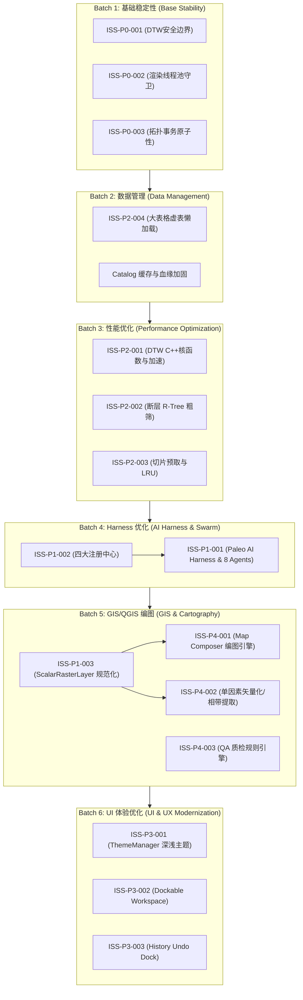

# Paleo Workbench 优先级矩阵与修复批次规划 (Priority Matrix & Batch Plan)

## 1. 影响度 vs 工作量矩阵 (Impact vs Effort Matrix)

```
高影响 (High Impact)
  ▲
  │   [ISS-P0-001: DTW边界加固]          [ISS-P1-001: AI Harness 核心]
  │   [ISS-P0-002: 渲染线程安全]          [ISS-P4-001: Map Composer 编图]
  │   [ISS-P0-003: 拓扑自愈回滚]          [ISS-P1-002: 四大注册中心]
  │   [ISS-P1-003: 栅格图层规范化]        [ISS-P4-002: 单因素矢量化]
  │   --------------------------------------------------------------
  │   [ISS-P2-001: DTW C++加速]          [ISS-P3-002: Dockable 工作区]
  │   [ISS-P2-002: 断层 R-Tree 索引]     [ISS-P4-003: QA 质检引擎]
  │   [ISS-P3-001: ThemeManager 多主题]   [ISS-P2-003: 切片优先级队列]
  │   [ISS-P3-003: 历史操作面板]          [ISS-P2-004: 大表懒加载]
  │
  └───────────────────────────────────────────────────────────────────► 高工作量 (High Effort)
      低工作量 (Low Effort)
```

---

## 2. 问题依赖拓扑图



---

## 3. 六大批次自动化修复实施路线图

### Batch 1: 基础稳定性 (Base Stability)
- **目标**: 消除崩溃隐患、内存越界、死锁与未捕获异常。
- **涉及 Issue**: `ISS-P0-001` (DTW 边界加固), `ISS-P0-002` (渲染线程池优雅关闭), `ISS-P0-003` (拓扑编辑原子性与自相交修复)。
- **产出文件**:
  - `paleo_workbench/viz/dtw_log_matcher.py`
  - `paleo_workbench/mapping/map_render_backend.py`
  - `paleo_workbench/mapping/topology.py`
  - `tests/test_stability_batch1.py`

### Batch 2: 数据管理 (Data Management)
- **目标**: 优化大表格加载、强化 Catalog 缓存一致性与数据血缘校验。
- **涉及 Issue**: `ISS-P2-004` (大表格懒加载与内存开销缩减)。
- **产出文件**:
  - `paleo_workbench/catalog/service.py`
  - `paleo_workbench/ui/pages/data_table_columns.py`
  - `paleo_workbench/workflow/well_table.py`
  - `tests/test_data_batch2.py`

### Batch 3: 性能优化 (Performance Optimization)
- **目标**: 核心算法 C++ / 向量化加速，引入 R-Tree 空间索引与切片预取。
- **涉及 Issue**: `ISS-P2-001` (DTW 动态规划加速), `ISS-P2-002` (断层 R-Tree 空间索引), `ISS-P2-003` (正交切片优先级预取)。
- **产出文件**:
  - `paleo_workbench/native_backend.py`
  - `paleo_workbench/_vendored/haiyou_constrained_idw/drawing/single_factor/constrained_engine.py`
  - `paleo_workbench/viz/seismic_load.py`
  - `tests/test_perf_batch3.py`

### Batch 4: Harness 优化 (AI Harness & Multi-Agent Swarm)
- **目标**: 建立四大注册表与闭环 AI GIS Harness，实现多 Agent 协同。
- **涉及 Issue**: `ISS-P1-001` (Paleo AI Harness 核心), `ISS-P1-002` (四大注册表机制)。
- **产出文件**:
  - `paleo_workbench/agent/__init__.py`
  - `paleo_workbench/agent/harness.py`
  - `paleo_workbench/agent/intent.py`
  - `paleo_workbench/agent/planner.py`
  - `paleo_workbench/agent/registries/` (`tool_registry.py`, `skill_registry.py`, `algorithm_registry.py`, `template_registry.py`)
  - `paleo_workbench/agent/agents/` (`base.py`, `data_agent.py`, `gis_agent.py`, `well_agent.py`, `seismic_agent.py`, `carto_agent.py`, `viz_agent.py`, `qa_agent.py`, `result_agent.py`)
  - `paleo_workbench/agent/tools/`
  - `tests/test_harness_batch4.py`

### Batch 5: GIS/QGIS 制图 (GIS & Cartography)
- **目标**: 统一标量栅格层，实现 Map Composer 声明式排版与单因素图矢量化。
- **涉及 Issue**: `ISS-P1-003` (ScalarRasterLayer 规范), `ISS-P4-001` (Map Composer), `ISS-P4-002` (单因素等值线/相带提取), `ISS-P4-003` (QA 质检引擎)。
- **产出文件**:
  - `paleo_workbench/mapping/scalar_raster_mirror.py`
  - `paleo_workbench/mapping/composer/` (`models.py`, `elements.py`, `renderer.py`, `templates.py`)
  - `paleo_workbench/mapping/single_factor_pipeline.py`
  - `paleo_workbench/workflow/qc.py`
  - `tests/test_gis_mapping_batch5.py`

### Batch 6: UI 体验优化 (UI & UX Modernization)
- **目标**: 实现 ThemeManager 深浅多主题动态切换、Dockable 工作区与编辑历史面板。
- **涉及 Issue**: `ISS-P3-001` (多主题引擎), `ISS-P3-002` (Dockable Workspace 预设), `ISS-P3-003` (Undo History 面板)。
- **产出文件**:
  - `paleo_workbench/ui/theme.py`
  - `paleo_workbench/ui/tokens.py`
  - `paleo_workbench/ui/dock_manager.py`
  - `paleo_workbench/ui/history_panel.py`
  - `tests/test_ui_batch6.py`
