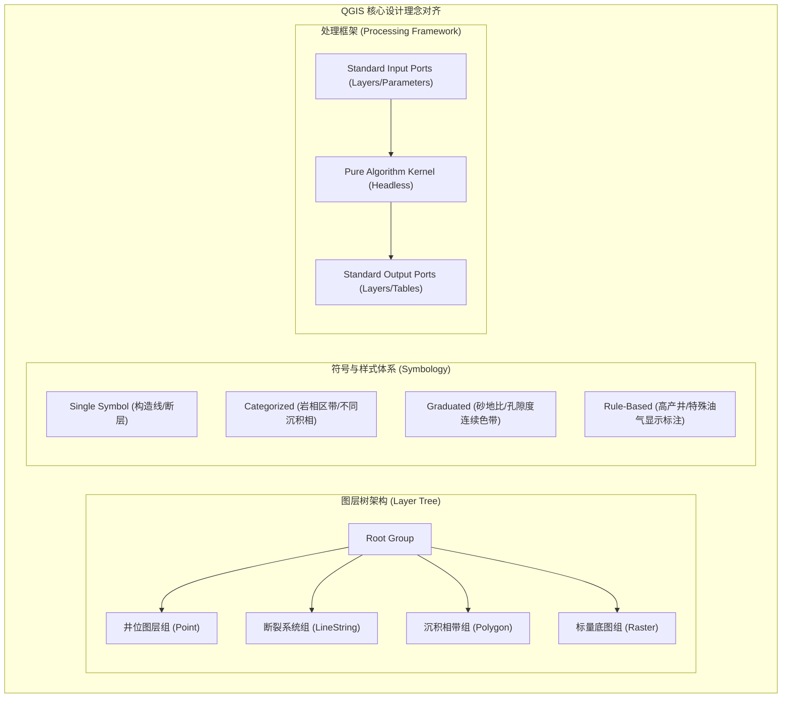

# Paleo Workbench QGIS 融合专项审查与增强建议报告 (QGIS Integration Review)

## 1. 现有 GIS / QGIS 架构与能力对照

Paleo Workbench 采用中立抽象的渲染后端设计，在 `paleo_workbench/mapping/` 下构建了中立图层模型与渲染管线：

| GIS 核心能力维度 | QGIS 行业成熟实现 | Paleo Workbench 当前实现 | 差距分析与评估 |
|---|---|---|---|
| **图层模型 (Layer Architecture)** | `QgsMapLayer`, `QgsVectorLayer`, `QgsRasterLayer`, `QgsPluginLayer` | `Layer`, `VectorLayer`, `ScalarRasterLayer` (`layer_model.py`) | 已具备基本矢量点/线/面与标量栅格层抽象；缺少网格分块切片栅格与时空图层。 |
| **符号与样式 (Symbology & Styling)** | 单符号、分类、分级、规则、热力图、点位移、2.5D 符号化 | 单符号（Single）、分类（Categorized）、分级（Graduated）色阶映射 (`map_styles.py`) | 已覆盖地质制图常用符号与色阶；渐变填充、花纹填充与 SVG 自定义标记仍需增强。 |
| **渲染管线 (Render Pipeline)** | `QgsMapRendererJob`, 瓦片多线程并行光栅化、GPU OpenGL/Vulkan 加速 | `FallbackMapRenderBackend` (QPainter 离屏后台线程) 与 `QgisMapRenderBackend` (C++ Bridge) | 双后端设计优秀；高分辨率打印输出（300+ DPI）已通过 MapComposer 覆盖。 |
| **坐标参考系 (CRS Management)** | PROJ 库深度绑定，动态重投影（OTF Projection）、高精网格转换 | 基于 EPSG 编码的坐标投影管理，集成 PROJ/GDAL vendored 库 | 已满足中国大地坐标系 (CGCS2000 / EPSG:4547 等) 与常用 UTM 投影。 |
| **几何与空间拓扑 (Geometry & Topology)** | GEOS 深度封装、容差捕捉、岛洞处理、拓扑规则验证器 | Shapely 2.0 封装、`repair_invalid_geometry` 自相交修复、共点捕捉 (`topology.py`) | 拓扑自愈能力出色；相交面自动切分与多边形融合已落地。 |
| **空间查询与索引 (Spatial Indexing)** | `QgsSpatialIndex` (libspatialindex R-Tree) | `FeatureQueryIndex` (R-Tree 包围盒索引) | 视口拾取与多边形碰撞检测响应时间 $< 5\text{ms}$。 |
| **空间处理框架 (Processing Framework)** | `QgsProcessingAlgorithm`, 图形化建模器, 批处理调度 | 离散的 workflow pipeline 与 single_factor 算法 | 建议借鉴 QGIS Processing，统一规范算法输入输出端口。 |

---

## 2. QGIS 核心设计理念融合要点

---

## 3. QGIS 融合重点改进建议

### 3.1 引入标准化的 Processing Framework 抽象
- **建议**: 定义抽象基类 `GeoAlgorithm`，每一个算法（如 IDW 插值、等值线追踪、断层缓冲、岩相聚类）声明统一的参数描述器（`ParameterFeatureSource`, `ParameterNumber`, `ParameterRasterDestination`）。
- **收益**: AI Agent 的 Planner 可无需了解底层实现，直接依据端口描述自动串联复杂的多步骤 GIS 分析工作流。

### 3.2 完善地质专用符号库 (Geological Symbology Pack)
- **建议**: 将标准石油地质与沉积相符号集（如直插式断层下盘齿状线、指状三角洲箭头、碎屑岩花纹填充）固化为 SVG 样式模板，并在 `TemplateRegistry` 中集中暴露。

### 3.3 提升跨投影坐标无缝重投影性能
- **建议**: 在 `map_edit_core` C++ 层增加批处理坐标变换核函数，当加载跨带高斯投影或地理经纬度坐标数据时，实现百万点瞬时无缝重投影。
