# Paleo Workbench 全系统架构深度分析与评审报告 (System Architecture Review)

## 1. 系统架构总览与定位

Paleo Workbench 是一款面向古地理图编制、多源地质数据协同解译、单井/连井测井绘图、三维地震解释以及智能岩相古地理制图的工业级多技术栈桌面工作台。系统有机融合了 C++ 高性能计算内核、PySide6 现代桌面交互层、QGIS 符号渲染引擎以及自主 AI GIS Harness 编排框架。

```mermaid
graph TD
    subgraph UI_Layer ["桌面交互与展示层 (PySide6 / Qt6)"]
        MainWindow["PaleoWorkbenchWindow (主窗口 / 导航系统)"]
        DataPage["DataPage (资产中心 / 预览 / 治理卡片)"]
        WellLogPage["WellLogPage (单井/连井测井绘图视口)"]
        SeismicPage["SeismicPage (三维地震体 / 正交切片联动)"]
        SingleFactorPage["SingleFactorPage (单因素图编制)"]
        MapAuthoringPage["MapAuthoringPage (统一制图画布 / 拓扑编辑)"]
        PredictionPage["PredictionPage (岩相预测与证据链)"]
        DockManager["DockManager (工作区布局预设与面板停靠)"]
        ThemeEngine["ThemeManager (Dark/Light/High-Contrast 主题)"]
    end

    subgraph Service_Layer ["核心业务与领域服务层 (Headless Pure Python)"]
        DataCatalogService["DataCatalogService (资产全生命周期 / CAS 寻址 / 不可变版本链)"]
        WorkflowService["WorkflowService (8步工序状态推断 / 证据链计算)"]
        GeometryService["GeometryService (空间几何、拓扑校验与自愈)"]
        InferenceService["InferenceService (ModelRegistry / 预测任务调度)"]
        DataAssetRegistry["DataAssetRegistry (多格式探测 / Preview / 导出注册)"]
        MapRenderBackend["MapRenderBackend (中立渲染切片 / Fallback & QGIS 双后端)"]
        MapComposer["MapComposer (声明式地图排版与矢量整饰引擎)"]
        SingleFactorPipeline["SingleFactorPipeline (标量场到等值线/相带多边形管线)"]
    end

    subgraph Harness_Layer ["AI GIS Harness 智能体编排层 (Autonomous Swarm)"]
        IntentParser["IntentParser (自然语言与地学意图解析)"]
        TaskPlanner["TaskPlanner (DAG 任务图动态生成)"]
        ToolRegistry["ToolRegistry (强类型工具注册与 JSON Schema 导出)"]
        SkillRegistry["SkillRegistry (复合业务 SOP 技能库)"]
        AlgorithmRegistry["AlgorithmRegistry (计算核函数元数据与性能模型)"]
        TemplateRegistry["TemplateRegistry (标准出版图幅与地质色阶模板)"]
        Swarm["8 大专业智能体集群 (Data, Well, Seismic, GIS, Carto, Viz, QA, Result)"]
    end

    subgraph Native_Layer ["高性能 C++ 本地计算内核 (pybind11 / SIMD)"]
        SeismicCore["seismic_3d_core (切片提取 / 相干属性 / 3D等值面)"]
        WellLogCore["well_log_core (4点Min-Max降采样 / LAS快速解析 / DTW)"]
        MapEditCore["map_edit_core (拓扑捕捉 / 空间索引)"]
        GridRenderCore["grid_render_core (标量网格 AVX2 光栅化)"]
        QgisBridge["qgis_render_bridge (QGIS C++ 符号渲染桥接)"]
    end

    subgraph Storage_Layer ["存储与外部资产 (CAS & Master)"]
        CatalogJSON["catalog.json (Canonical Master)"]
        CatalogDB["catalog.sqlite (Rebuildable Index)"]
        CASPayloads[".artifacts/{raw,derived,intermediate,outputs}/ (只读不可变载荷)"]
        VendoredLibs["_vendored/haiyou_constrained_idw (纯 NumPy 约束 IDW)"]
    end

    UI_Layer --> Service_Layer
    UI_Layer --> Harness_Layer
    Harness_Layer --> Service_Layer
    Service_Layer --> Native_Layer
    Service_Layer --> Storage_Layer
    Native_Layer --> Storage_Layer
```



---

## 2. 模块边界与子系统架构分析

### 2.1 核心子系统划分与代码规模

| 模块名称 | 物理路径 | 核心职责 | 边界清晰度 | 架构评价 |
|---|---|---|---|---|
| **Catalog** | `paleo_workbench/catalog/` | 资产全生命周期（RAW/DERIVED/INTERMEDIATE/OUTPUT）、CAS 寻址、不可变版本控制、数据血缘图（LineageGraph）、SQLite 增量索引与垃圾回收。 | 优秀 | 严格遵循 ADR 0056，单写入口，主从数据分离（JSON 为主，SQLite 为辅），容错性高。 |
| **Workflow** | `paleo_workbench/workflow/` | 8 步工序编排（数据准备→层序格架→单因素图→智能预测→综合编图→成果质检）、证据链与新鲜度计算、单因素约束 IDW 适配器。 | 良好 | 状态推断基于证据链事实，无私有隐式状态。 |
| **Mapping** | `paleo_workbench/mapping/` | 统一制图画布、矢量图层模型、拓扑编辑与自愈（FeatureEditor）、QGIS 样式编码器、Fallback/QGIS 双渲染后端、Map Composer 排版器。 | 优秀 | 渲染与数据解耦清晰，支持声明式图层快照与 QPainter/QGIS 离屏绘制。 |
| **Agent / Harness** | `paleo_workbench/agent/` | AI 意图理解、DAG 任务规划器、四大注册中心（Tool/Skill/Algorithm/Template）、8 大专业协同智能体集群与主协调引擎（PaleoAIHarness）。 | 优异 | 现代智能体闭环架构，支持自然语言到复杂 GIS 编图的端到端自动化执行。 |
| **Viz** | `paleo_workbench/viz/` | 地震三维卷体与正交切片联动、井震联合三维剖面、地层对比基准面拉平（WellSectionDatum）、DTW 曲线形态对齐、三维地质体积分。 | 良好 | 算法与视图分离，提供纯 Python 回退与 C++ 调度接口。 |
| **Resources** | `paleo_workbench/resources/` | 格式探测规范（FormatSpec）、文件分类扫描、表格/文本/图片/GeoTIFF/LAS 多格式轻量解析器与 LRU 磁盘缓存。 | 良好 | 承担 IO 与预览职责，与 Catalog 资产管理清晰分工。 |
| **Prediction** | `paleo_workbench/prediction/` | 模型注册表（ModelRegistry）、纯 Python 无框架绑定的推理调度（InferenceService）、Demo/Heuristic Facies 适配器。 | 良好 | 推理记录关联 DataRun，提供可追溯血缘。 |
| **UI** | `paleo_workbench/ui/` | Qt 桌面 UI 实现，包括页面（Pages）、组件（Widgets）、设计令牌（Tokens）、多主题引擎（ThemeManager）、工作区布局（DockManager）。 | 良好 | 实现了深浅多主题与工作区预设，正在逐步由 Splitter 转向全 Dock 架构。 |
| **Native** | `native/` | pybind11 C++ 原生扩展（`seismic_3d_core`, `well_log_core`, `grid_render_core`, `map_edit_core`, `qgis_render_bridge`）。 | 优异 | 严格遵循 Symmetric Parity 对称回退契约，具备完备的纯 Python 兜底。 |
| **Vendored** | `paleo_workbench/_vendored/` | 从 `haiyou-visualization` 裁剪集成的各向异性约束 IDW、断层视线遮挡、各向异性廊道与网格计算纯算法库。 | 优秀 | 零 GUI 依赖，纯 NumPy 向量化运算。 |

---

## 3. 系统数据流、控制流与交互流

### 3.1 数据流 (Data Flow)
```
[外部源文件 (LAS/SEG-Y/SHP/TIF)]
          │ (DataAssetRegistry.inspect 格式探测)
          ▼
[DataCatalogService.import_raw (Hash-while-copy 单遍落盘)]
          │
          ▼
[CAS 块存储 (.artifacts/raw/{id}/{ver}/) + catalog.json Master]
          │
          ├──────────────────────────┬──────────────────────────┐
          ▼                          ▼                          ▼
[测井曲线/井位数据]           [三维地震体切片]             [断层/构造多边形]
          │                          │                          │
          ├──────────────────────────┴──────────────────────────┘
          ▼
[SingleFactorPipeline / Haiyou Constrained IDW (各向异性约束插值)]
          │
          ▼
[ScalarRasterLayer / 标量栅格场] ──► [Marching Squares / 等值线 & 相带面]
          │                                      │
          └──────────────────┬───────────────────┘
                             ▼
             [MapAuthoring / 拓扑校验与自愈]
                             │
                             ▼
             [MapComposer / 标准图幅整饰排版]
                             │
                             ▼
             [出版级交付物 (SVG / PDF / GeoTIFF)]
```

### 3.2 控制流与服务交互 (Control Flow)
- **无头服务独立性**: 业务服务（Catalog, Workflow, Mapping, Harness）均为 Qt-free 设计，既可由桌面 UI 控件通过异步 Worker 触发，也可通过命令行脚本或 AI Agent 直接通过 RPC/API 调度。
- **对称性回退策略 (SymmetricParityContract)**:
  - 运行时首先尝试加载 C++ 原生扩展；若环境缺失编译库或被 `with native_backend.disabled_acceleration():` 显式禁用，系统自动切换为纯 Python 算法，输出在紧密容差内 100% 一致。

---

## 4. 关键架构瓶颈与改进建议

1. **统一数据总线与事件总线 (EventBus)**:
   - 当前部分复杂页面跨面板通信依赖深层 Qt 信号链条，建议引入轻量级 `DomainEventBus`，统一分发 `AssetImportedEvent`, `HorizonChangedEvent`, `MapStyleUpdatedEvent`。
2. **Headless API 彻底标准化**:
   - 保证所有交互操作（如移动顶点、切换切片、执行插值）均封装为具备序列化能力的 `Command` 对象，便于 AI Agent 录制、重放与撤销。
3. **QGIS 核心 Processing 体系对齐**:
   - 借鉴 QGIS Processing Framework，将所有分析算法统一抽象为 `GeoAlgorithm`，提供标准输入/输出端口定义与管道链式组合能力。
