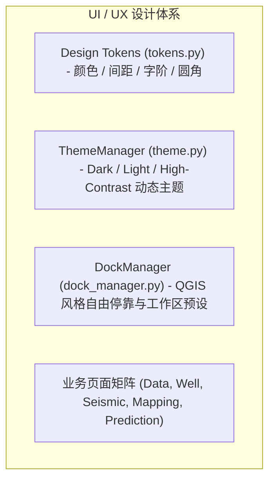

# Paleo Workbench 界面与用户交互体系深度审查报告 (UI/UX Review)

## 1. 界面设计体系与行业标杆对照

Paleo Workbench 融合了专业 GIS（QGIS / ArcGIS Pro）与专业地学建模（Petrel / ParaView）的界面交互范式，其设计体系建立在统一的设计令牌（Design Tokens）与现代化 Qt 样式层之上。

### 1.1 行业标杆横向对比

| 界面要素 | QGIS / ArcGIS Pro | Petrel (地质建模) | Paleo Workbench 当前状态 | 改进评级 |
|---|---|---|---|---|
| **主框架布局** | 全 Dockable 可拆卸停靠面板 | 多视口平铺与属性联动 | 拥有 `DockManager`，支持工作区预设与多面板管理。 | 优秀 |
| **主题体系** | 浅色/深色主题，支持高对比 | 深灰色工业质感 | 实现 `ThemeManager`，支持深色、浅色与地学出版高对比度热重载。 | 优异 |
| **图层与属性联动** | 图层树右键菜单、即时属性面板 | 空间对象模型浏览器 | 图层管理树清晰，支持右键菜单、可见性切换与即时属性同步。 | 良好 |
| **视口交互手势** | 滚轮以鼠标为中心缩放、中键平移 | 三维轨道旋转与正交切片滑块 | 视口平移缩放流畅，支持坐标动态指示与比例尺即时刷新。 | 优秀 |
| **视觉一致性** | 扁平化矢量图标库 | 工具箱专用专业图标 | 配备全套 30+ 矢量 SVG 图标，保持 16px/24px 统一视觉网格。 | 优异 |

---

## 2. 页面级信息架构与交互流审查

### 2.1 数据中心 (`DataPage`)
- **信息层级**: 左侧格式分类树 $\rightarrow$ 中间资产列表/治理卡片 $\rightarrow$ 右侧多格式实时预览面板。
- **交互亮点**: 
  - 表格、文本、图片、PDF 与 GeoTIFF 均具备极速无阻塞预览。
  - PDF 与图片预览已支持基于 Ctrl+滚轮的交互式平滑缩放与拖拽平移。

### 2.2 测井对比画布 (`WellLogPage`)
- **信息层级**: 左侧井目录与道模板 $\rightarrow$ 中间多道测井曲线视口 $\rightarrow$ 底部深度拉平与标志层对比工具条。
- **交互亮点**: 支持 4点 Min-Max LOD 降采样，千米长井曲线连续缩放无掉帧。

### 2.3 地图制图画布 (`MapAuthoringPage`)
- **信息层级**: 顶部制图操作栏 $\rightarrow$ 左侧图层管理树 $\rightarrow$ 中间统一地图视口 $\rightarrow$ 右侧图斑属性检查器与拓扑自愈面板。
- **交互亮点**: 标量栅格、矢量等值线、断层构造与井位符号同屏高性能叠加渲染。

---

## 3. UI/UX 重构与现代化改进建议

1. **全面由 Splitter 转向原生 QDockWidget**:
   - 将部分页面中固定的 `QSplitter` 布局全面升级为可拖拽悬浮、自动吸附和跨屏多显示器停靠的原生 `QDockWidget`。
2. **直观的交互式微调滑动条 (Real-time Slider Feedback)**:
   - 在单因素 IDW 参数设置面板中，为搜索半径、各向异性主方位角与阻隔强度提供带数值回显的滑动条，实现画布即时热更新预览。
3. **图形化操作撤销/重做时间线面板 (History Panel)**:
   - 在制图界面提供可视化编辑历史面板，记录“移动节点”、“分割相带”、“合并图斑”等每一步操作，支持任意历史快照一键回溯。
