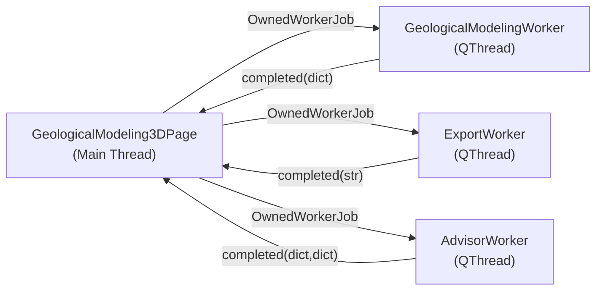

# 三维地质建模模块 (`viz/geomodel`) 架构文档

> **Branch:** `3D`
> **Last updated:** 2026-08-08

## 概述

`paleo_workbench.viz.geomodel` 是三维地质建模的**薄适配层**：可视化引擎核心
（GL 渲染原语、钻孔/巷道/断层几何、井震标定、RGB 混色、等时/比例地层切片）已全部
下沉到 `geo-viz-engine`，主仓库只保留领域模型、业务级 AI 顾问、数值模拟导出，
以及对 `geoviz` facade 的调用。完整的迁移清单与边界规则见
`docs/agents/geo-viz-boundary.md`。

## 模块结构（迁移后）

```
paleo_workbench/viz/geomodel/     ← 薄适配层
├── __init__.py              # facade 再导出 + 4 个无算法兼容 shim 类
├── models.py                # 领域 dataclass（保留）
├── advisor.py               # 业务级 AI 顾问（保留）
└── exporters.py             # 数值模拟导出（保留）

paleo_workbench/viz/stratal_adapter.py   # 工作台胶水：.dat horizon → 预览体 sample-index 网格（阶段2/3 新增）

paleo_workbench/ui/pages/
├── geological_modeling_3d_page.py   # 井震联合工作台 Page（双列 + 分析标签面板）
├── geological_modeling_workers.py   # QThread Worker（遗留建模/导出/诊断）
└── ai_check_advisor_dialog.py       # AI 诊断报告弹窗
```

> **已删除**（算法已下沉到 geo-viz-engine）：`engine.py`、`well_seismic.py`、
> `borehole_tunnel.py`、`fault_dislocation.py`、`fence_generator.py`。
> 包级 `from paleo_workbench.viz.geomodel import <symbol>` 对所有旧符号仍可用（薄适配层再导出）。

## 领域数据模型 (`models.py`)

| 类 | 用途 |
|---|---|
| `Layer` | 钻孔内单一岩性层（顶/底深度、岩性、颜色） |
| `BoreholeRecord` | 钻孔记录（名称、坐标、总深度、层序列表） |
| `FaultRecord` | 断层面（名称、法线向量、偏移量 D） |
| `TunnelRecord` | 巷道（名称、三维路径点、颜色） |
| `GridSpec` | 数值模拟网格参数 (nx, ny, nz, dx, dy, dz) |

所有模型均为 `@dataclass`，`advisor.py` 保留了向后兼容的 `dict → dataclass` 自动转换。

## 渲染引擎（已下沉到 geo-viz-engine）

> 原本地 `engine.py` 的 GL 渲染原语与几何生成器已迁移到 `geoviz` facade。
> 通过 `from geoviz import ...` 访问；薄适配层 `viz/geomodel/__init__.py` 再导出同名符号。

### GPU 三向剖切

`ClippedGLMeshItem` 和 `ClippedGLVolumeItem`（现在 `geoviz_seismic.gl_clipping`）继承自 pyqtgraph.opengl 的 `GLMeshItem` / `GLVolumeItem`，在 `paint()` 中通过 `GL_CLIP_PLANE0/1/2` 实现实时 X/Y/Z 三向剖切。

```python
item.set_clipping('x', enabled=True, val=0.0, direction=1.0)
```

### 几何生成器

| 函数（现在 `geoviz_plots.geomodel.primitives`） | 输出 |
|---|---|
| `generate_cylinder_geometry(p1, p2, radius, color)` | 圆柱体 (verts, faces, colors) |
| `generate_tube_geometry(path, radius, color)` | 沿路径扫掠的管道 |
| `generate_fault_geometry(xlim, ylim, color)` | 断层平面网格 |

## 等时/比例地层切片（阶段 2 新增，geo-viz-engine 核心）

在两个 horizon 之间按比例生成地层切片，沿地层格架揭示沉积相。纯 numpy 核心
（`geoviz_seismic.stratal`）+ 3D 渲染接入（`Renderer3D.set_stratal_slices`）。

| facade 函数 | 功能 |
|---|---|
| `build_proportional_surfaces(top, bottom, fractions)` | 在两个 horizon 间按比例插值出多个曲面 |
| `extract_stratal_slice(volume, surface)` | 沿一张（非平面）曲面用线性 T 插值采样体 |
| `stratal_slice_volume(volume, top, bottom, fractions)` | 端到端：建曲面 + 采样，返回振幅图 |
| `validate_horizon_pair(top, bottom)` | 校验/掩码倒转、NaN、越界单元 |

工作台适配层 `viz/stratal_adapter.py` 负责把 `.dat` horizon 解析为预览体对齐的
sample-index 网格（survey/registration 感知），并提供无 SEGY 时的合成演示体。
详见引擎文档 `geo-viz-engine/docs/reference-stratal-slices.md`。

## 井震标定（已下沉到 geo-viz-engine）

> 原 `well_seismic.py` 的算法已迁移到 `geoviz_well_tie` / `geoviz_well_seismic_3d` /
> `geoviz_seismic`。薄适配层保留 4 个无算法的兼容 shim 类（只转发参数）。

| 旧方法（兼容 shim） | 委托到 facade |
|---|---|
| `WellSeismicTieCalibration.compute_synthetic` | `geoviz.synthetic_from_logs` |
| `WellSeismicTieCalibration.auto_correlate` | `geoviz.correlate_synthetic_to_trace` |
| `WellSeismicTieCalibration.align_twt_depth` | `geoviz.shift_depths` |
| `WellCurve3DGenerator.generate_curve_mesh` | `geoviz.offset_curve_along_trajectory` |
| `RGBAttributeFusion.blend_rgb` | `geoviz.blend_rgba` |
| `LithologyCrossplotEngine.analyze` | `geoviz.analyze_lithology_crossplot` |

新代码请直接用 facade 函数。

## AI 数据一致性诊断 (`advisor.py`)

| 函数 | 检查内容 |
|---|---|
| `check_boreholes(records)` | 坐标有效性、层位反转、层位重叠、总深超限 |
| `check_coplanar_faults(records)` | 法线夹角 < 5°且间距 < 15m 的共面断层 |

## 数值模拟导出 (`exporters.py`)

内部使用共享函数 `_generate_structured_grid(GridSpec)` 生成向量化的结构六面体网格（`np.meshgrid`），然后分别输出为：

- **FLAC3D** (`.f3grid`): `GRID` 节点 + `ZON hex` 单元
- **Abaqus** (`.inp`): `*NODE` + `*ELEMENT, TYPE=C3D8` 格式

## UI 页面布局（井震联合工作台）

```
┌─────────────┬──────────────────────────────────────┐
│ 模型层次树   │ 浮动工具栏(域/正交切片/分析/交互/井间/导航)│
│ (QTreeWidget│ ┌──────────────────────────────────┐ │
│  checkable) │ │正交切片卡 / 分析标签面板(可切换)   │ │
│  井震联合    │ │  等时切片与属性 | 井震标定 |       │ │
│   ├ 地震预览 │ │  沉积相解释 | 导出与诊断           │ │
│   ├ 联合井轨迹│ └──────────────────────────────────┘ │
│   ├ 井间fence│ ┌──────────────────────────────────┐ │
│   ├ 地层切片体│ │ 3D 井震联合视口 (Joint3DHost)     │ │
│   ├ 3D 视口  │ │   WellSeismicJointWidget          │ │
│   └ 2D 剖面条│ └──────────────────────────────────┘ │
│             │ ┌──────────────────────────────────┐ │
│             │ │ 2D 井震剖面条 (可折叠, Time-only) │ │
│             │ └──────────────────────────────────┘ │
└─────────────┴──────────────────────────────────────┘
```

- 双列布局（树 | 3D+2D），既有隐藏右轨仅保留遗留建模 chrome（不进 splitter）。
- 「分析」按钮切换的专业标签面板承载阶段 2 的等时切片入口 + 既有的井震标定 / 沉积相 / 导出诊断。
- 跨页联动：3D 视口拾取井 → `well_selected` 信号 → `WorkflowController` → `WellLogPredictionPage.set_selected_well`。

### 三维场景对象树（左面板，单根组「井震联合 (geoviz)」）

- 地震预览体 (geoviz)
- 联合井轨迹 (geoviz)（每井独立 checkbox 子项）
- 井间剖面 fence (geoviz)
- 地层切片体 (geoviz)（阶段 3 新增，联动 stratal 可见性）
- 井震 3D 视口 / 井震 2D 剖面条

## 后台 Worker 线程架构



所有 Worker 通过 `OwnedWorkerJob` 管理线程生命周期，防止 UI 线程阻塞。

## 测试覆盖

主仓库（井震联合 + 阶段 2/3）：

| 测试文件 | 测试数 | 覆盖范围 |
|---|---|---|
| `test_modeling_borehole.py` | 7 | 钻孔分层分割、偏斜井、边界情况（走薄适配层） |
| `test_modeling_tunnel.py` | 4 | 直线/弯曲巷道、参数校验、绕序（走薄适配层） |
| `test_modeling_fault.py` | 12 | 刚性错断、分裂抛掷、线性/指数/高斯衰减、异常分支（走薄适配层） |
| `test_modeling_well_seismic.py` | 4 | 合成记录、时深校正、互相关恢复、空输入（走薄适配层） |
| `test_modeling_curve_3d.py` | 1 | 三维曲线网格生成（走薄适配层） |
| `test_modeling_analysis_advanced.py` | 11 | RGB 混色、岩性交会、井间 fence（走薄适配层） |
| `test_geological_modeling_3d_page.py` | 5 | UI 控件、剖切、井震标定 |
| `test_geomodel_joint_layout.py` | 16 | 双列布局、模型树、工具栏、井 checkbox |
| `test_stratal_adapter.py` | 5 | stratal 适配层（演示体、horizon 校验、端到端） |
| `test_stratal_page_entry.py` | 7 | stratal 页面入口 + 最小可观察结果 |
| `test_cross_page_well_sync.py` | 4 | 3D→WellLog 井选中同步 |

geo-viz-engine（阶段 2 新增）：

| 测试文件 | 测试数 | 覆盖范围 |
|---|---|---|
| `test_stratal_slice.py` | 63 | 纯 numpy 算法（曲面、线性插值、窗口聚合、NaN 传播） |
| `test_renderer_3d_stratal.py` | 52 | Renderer3D stratal 渲染接入（状态 + GL 平面） |
| `test_geomodel_geometry.py` / `test_gl_clipping.py` / `test_well_seismic_promoted.py` | 89 | 阶段 1 下沉代码的回归 |

### 本地验证

```bash
./scripts/run_tests.sh workbench -q -m "not slow"   # 主仓库
./scripts/run_tests.sh engine    -q -m "not slow"   # geo-viz-engine（子模块 checkout）
```
（脚本钉住 conda 解释器 PATH、offscreen GL、子模块 PYTHONPATH。已修复 PATH bug。）
