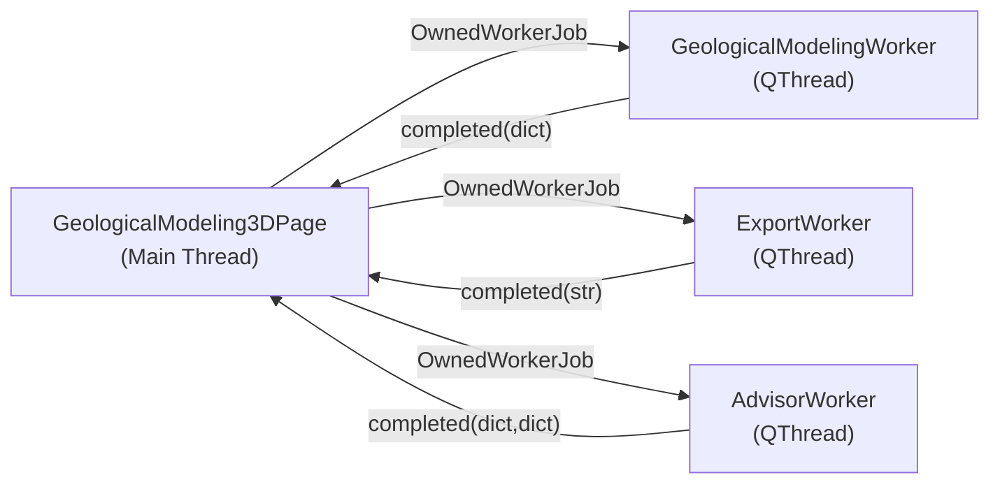

# 三维地质建模模块 (`viz/geomodel`) 架构文档

> **Branch:** `feature/3d-geological-modeling`
> **Last updated:** 2026-07-22

## 概述

`paleo_workbench.viz.geomodel` 是 PaleoWorkbench 的三维地质建模引擎，实现了钻孔、巷道、断层的三维可视化，以及井震标定、地震切片叠加、AI 数据一致性诊断、数值模拟导出等功能。

## 模块结构

```
paleo_workbench/viz/geomodel/
├── __init__.py              # 公开 API 导出（47 个符号）
├── models.py                # 领域数据模型 (dataclasses)
├── engine.py                # OpenGL 渲染原语 + GPU 剖切 (GLSL shaders)
├── borehole_tunnel.py       # 钻孔分层圆柱 & 巷道管道几何生成
├── fault_dislocation.py     # 断层错断引擎 (FaultCuttingEngine)
├── well_seismic.py          # 合成地震记录 & 井旁曲线3D生成
├── advisor.py               # AI 数据一致性分析 (钻孔/断层)
└── exporters.py             # FLAC3D / Abaqus 结构网格导出

paleo_workbench/ui/pages/
├── geological_modeling_3d_page.py   # 三列布局 Page Widget
├── geological_modeling_workers.py   # QThread Worker (建模/导出/诊断)
└── ai_check_advisor_dialog.py       # AI 诊断报告弹窗
```

## 领域数据模型 (`models.py`)

| 类 | 用途 |
|---|---|
| `Layer` | 钻孔内单一岩性层（顶/底深度、岩性、颜色） |
| `BoreholeRecord` | 钻孔记录（名称、坐标、总深度、层序列表） |
| `FaultRecord` | 断层面（名称、法线向量、偏移量 D） |
| `TunnelRecord` | 巷道（名称、三维路径点、颜色） |
| `GridSpec` | 数值模拟网格参数 (nx, ny, nz, dx, dy, dz) |

所有模型均为 `@dataclass`，`advisor.py` 保留了向后兼容的 `dict → dataclass` 自动转换。

## 渲染引擎 (`engine.py`)

### GPU 三向剖切

`ClippedGLMeshItem` 和 `ClippedGLVolumeItem` 继承自 pyqtgraph.opengl 的 `GLMeshItem` / `GLVolumeItem`，在 `paint()` 中通过 `GL_CLIP_PLANE0/1/2` 实现实时 X/Y/Z 三向剖切。

```python
item.set_clipping('x', enabled=True, val=0.0, direction=1.0)
```

### 几何生成器

| 函数 | 输出 |
|---|---|
| `generate_cylinder_geometry(p1, p2, radius, color)` | 圆柱体 (verts, faces, colors) |
| `generate_tube_geometry(path, radius, color)` | 沿路径扫掠的管道 |
| `generate_fault_geometry(xlim, ylim, color)` | 断层平面网格 |

## 井震标定 (`well_seismic.py`)

### `WellSeismicTieCalibration`

| 方法 | 功能 |
|---|---|
| `compute_synthetic(sonic, density, freq, dt)` | Ricker 子波合成地震记录 |
| `auto_correlate(synthetic, seismic_trace)` | 互相关自动标定，返回 `(shift_samples, CC)` |
| `align_twt_depth(depths, depth_shift)` | 时深偏移校正 |

### `WellCurve3DGenerator`

`generate_curve_mesh(well_path, curve_values, scale)` — 沿井轨迹将测井曲线值投影到水平面法线方向，生成可直接传入 `GLLinePlotItem` 的三维坐标数组。

## AI 数据一致性诊断 (`advisor.py`)

| 函数 | 检查内容 |
|---|---|
| `check_boreholes(records)` | 坐标有效性、层位反转、层位重叠、总深超限 |
| `check_coplanar_faults(records)` | 法线夹角 < 5°且间距 < 15m 的共面断层 |

## 数值模拟导出 (`exporters.py`)

内部使用共享函数 `_generate_structured_grid(GridSpec)` 生成向量化的结构六面体网格（`np.meshgrid`），然后分别输出为：

- **FLAC3D** (`.f3grid`): `GRID` 节点 + `ZON hex` 单元
- **Abaqus** (`.inp`): `*NODE` + `*ELEMENT, TYPE=C3D8` 格式

## UI 页面布局

```
┌─────────────┬──────────────────────┬─────────────────┐
│  模型层次树  │                      │  建模计算参数    │
│  (QTreeWidget│   3D OpenGL 视口     │  三向剖切控制    │
│   checkable) │   (GLViewWidget)     │  数值模拟导出    │
│             │                      │  AI 诊断顾问     │
│             │   ┌───────────┐      │  井震融合校正    │
│             │   │浮动工具栏  │      │                 │
│             │   └───────────┘      │                 │
└─────────────┴──────────────────────┴─────────────────┘
```

### 三维场景对象树（左面板）

- 地层构造格架: LST/TST 顶底面
- 断层格架模型: F1/F2 Surface
- 巷道与井下系统: 巷道 A/B
- 钻孔与井迹: HZ21-1, HZ19-6, XJ24-3, HZ25-2
- 井震融合标定与校正:
  - 地震剖面三维切片 (Seismic Slices) — 水平振幅切片面
  - 井眼旁显测井曲线 (3D GR Logs) — 绿色 GR 曲线
  - 合成地震记录叠加 (Synthetic Seismograms) — 橙色 Wiggle 道

## 后台 Worker 线程架构



所有 Worker 通过 `OwnedWorkerJob` 管理线程生命周期，防止 UI 线程阻塞。

## 测试覆盖

| 测试文件 | 测试数 | 覆盖范围 |
|---|---|---|
| `test_modeling_borehole.py` | 7 | 钻孔分层分割、偏斜井、边界情况 |
| `test_modeling_tunnel.py` | 4 | 直线/弯曲巷道、参数校验、绕序 |
| `test_modeling_fault.py` | 8 | 刚性错断、分裂抛掷、线性衰减、面形状 |
| `test_modeling_well_seismic.py` | 4 | 合成记录、时深校正、互相关恢复、空输入 |
| `test_modeling_curve_3d.py` | 1 | 三维曲线网格生成 |
| `test_geological_modeling_3d_page.py` | 4 | 几何生成器、导出、AI 诊断、UI 控件集成 |
| **总计** | **28** | |
