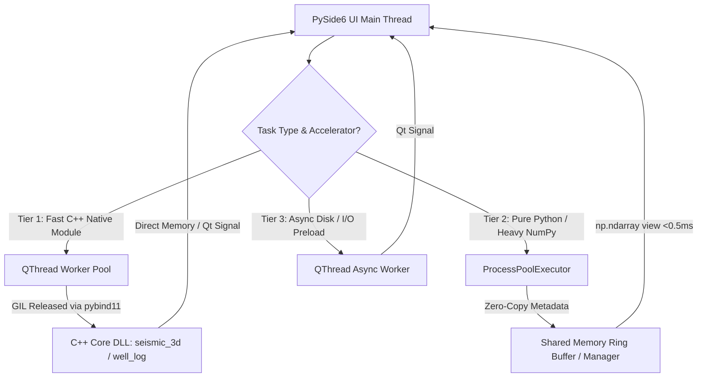

# [Decision] PySide6 UI Main Thread Zero-Blocking Architecture & Inter-Process Communication (IPC) for GeoViz

**Author/Owner:** GeoViz Core Architecture Team  
**Date:** 2026-07-21  
**Status:** Proposed / Research Complete (Addresses Issue #10)

---

## 1. Executive Summary & Problem Statement

### 1.1 Context & Performance Challenges in GeoViz
GeoViz is the core visualization and spatial/geological calculation subsystem of Paleo Workbench. It operates on high-volume datasets:
- **3D Seismic Volumes**: Post-stack/pre-stack seismic amplitude cubes ranging from 100 MB to 4 GB+ ($500 \times 500 \times 1000$ to $2000 \times 2000 \times 1500$ `float32` arrays).
- **High-Density Well Logs**: Dozens of log curves per well with sub-meter sampling over thousands of meters (millions of data points).
- **Surface & Mesh Generation**: Isoline extraction (Contouring), Delaunay triangulation, Marching Cubes 3D mesh generation, and Horizon surface interpolation.

### 1.2 The Bottleneck: UI Thread Freeze & Python GIL
PySide6 (Qt for Python) uses a single-threaded event loop (`QApplication.exec()`) on the Main UI Thread. Any computation exceeding **16.6 ms** on the main thread causes frame drops below 60 FPS; computations exceeding **100 ms** result in noticeable UI stutter; computations over **500 ms** trigger window freeze and OS "Not Responding" warnings.

Furthermore, Python's Global Interpreter Lock (GIL) creates two distinct constraints:
1. **Pure Python/NumPy on `QThread`**: Standard Python `QThread` workers execute within the single Python process GIL. Heavy CPU-bound Python loops (e.g. spatial interpolation, custom filtering) block other Python worker threads and can stall UI signal delivery.
2. **IPC Copy Overhead in Multiprocessing**: Offloading CPU calculations to `multiprocessing` processes bypasses the GIL, but standard `multiprocessing.Pipe` / `Queue` uses `pickle` serialization. Transferring a 1 GB NumPy array across process boundaries via pickle takes **200ms - 600ms**, completely negating the benefits of background computation.

### 1.3 Core Requirements
1. **Zero UI Thread Blockage**: The UI main thread must strictly handle event dispatching, widget updates, and GPU rendering (OpenGL / VisPy / PyQtGraph).
2. **Sub-1ms Array Transfer Latency**: Large NumPy arrays ($>100\text{ MB}$) must be transferred between compute processes and the UI thread with zero-copy shared memory.
3. **Robust Lifecycle & Teardown Management**: Background processes and threads must shut down cleanly without zombie processes, memory leaks, or Shiboken PySide6 C++ wrapper segfaults.

---

## 2. Background Worker Architectures: QThread vs ProcessPoolExecutor

### 2.1 PySide6 `QThread` (In-Process Worker)

#### Architecture & Pattern in Paleo Workbench
Paleo Workbench implements the `OwnedWorkerJob` pattern (`paleo_workbench/ui/owned_worker_job.py`), which pairs a `QThread` with a `QObject` worker using `moveToThread()` and deferred `deleteLater()` cleanup.

```
+-------------------------------------------------------------------+
|                        PySide6 Main Thread                        |
|  +---------------------+        +------------------------------+  |
|  |   UI Widget / View  |        | PreviewRequestController    |  |
|  +----------+----------+        +--------------+---------------+  |
|             | Signal                           | Slot             |
+-------------|----------------------------------|------------------+
              | Qt Queued Connection             ^ Qt Queued Signal
              v                                  |
+-------------+----------------------------------+------------------+
|                   QThread Worker Event Loop                       |
|  +-------------------------------------------------------------+  |
|  | Worker Object (run / execute)                               |  |
|  | - GIL Release via C++ native extension (pybind11)            |  |
|  | - I/O operations (Disk/Network)                            |  |
|  +-------------------------------------------------------------+  |
+-------------------------------------------------------------------+
```

#### Evaluation Matrix for QThread
- **Strengths**:
  - Seamless Qt Signal/Slot integration with queued connections.
  - Zero IPC memory copying cost for objects in the same Python process.
  - Ideal for C++ native extensions (`native/seismic_3d_core`, `native/well_log_core`) that explicitly release the GIL via `py::gil_scoped_release`.
- **Weaknesses**:
  - Pure Python CPU-bound workloads block all other Python threads due to the GIL.
  - Process crashes in C++ code take down the entire Qt GUI.

### 2.2 `ProcessPoolExecutor` / Multiprocessing (Out-of-Process Worker)

#### Architecture & Pattern
Runs independent Python worker processes in a process pool (`concurrent.futures.ProcessPoolExecutor`).

```
+-------------------------------------------------------------------+
|                        PySide6 Main Thread                        |
|  +---------------------+        +------------------------------+  |
|  |   UI Widget / View  | <----> |   QProcessFutureBridge       |  |
|  +---------------------+        +--------------+---------------+  |
+------------------------------------------------|------------------+
                                                 | Non-blocking futures poll
                                                 v
+-------------------------------------------------------------------+
|                     ProcessPoolExecutor Pool                      |
|   +-------------------+    +-------------------+    +-----------+ |
|   | Worker Process 1  |    | Worker Process 2  |    | Worker N  | |
|   | (Isolated GIL)    |    | (Isolated GIL)    |    | ...       | |
|   +-------------------+    +-------------------+    +-----------+ |
+-------------------------------------------------------------------+
```

#### Evaluation Matrix for Multiprocessing
- **Strengths**:
  - 100% GIL bypass; full utilization of multi-core CPUs for pure Python/NumPy calculations.
  - Total process isolation: crash in worker process does not affect Qt GUI.
- **Weaknesses**:
  - High process creation overhead (mitigated by using persistent pool workers).
  - High IPC serialization cost if using standard `Queue`/`Pipe` pickling.

---

## 3. Evaluation of Zero-Copy Shared Memory for NumPy Transfers

### 3.1 Shared Memory Mechanisms Comparison

| Mechanism | Latency (1 GB Array) | Memory Copy Count | Platform Support | Python API | Lifecycle / Cleanup Safety |
|---|---|---|---|---|---|
| **Standard IPC (Pipe / Pickle)** | 350 - 600 ms | 3-4 copies | All | `multiprocessing.Pipe` / `Queue` | Automatic (Garbage collected) |
| **`multiprocessing.shared_memory.SharedMemory`** | **< 0.5 ms** | **0 copies** | Linux (`/dev/shm`), Win32, macOS | Standard library `multiprocessing.shared_memory` (Python 3.8+) | Requires explicit `close()` & `unlink()` |
| **Qt `QSharedMemory`** | < 0.5 ms | 0 copies (via raw ptr) | All | `PySide6.QtCore.QSharedMemory` | Qt Managed (Detaches on process exit) |
| **Memory-Mapped Files (`np.memmap`)** | 1 - 5 ms (RAM cache) | 0 copies | All | `numpy.memmap` / `mmap` | File system backed (Requires temp file cleanup) |

### 3.2 Deep-Dive: `multiprocessing.shared_memory` Zero-Copy Protocol

`multiprocessing.shared_memory.SharedMemory` allocates shared memory segments accessible across process boundaries via a unique string name.

#### Zero-Copy Array Serialization Protocol:
1. **Producer (Worker Process)**:
   - Allocates `shm = SharedMemory(create=True, size=nbytes)`.
   - Creates a NumPy array view over the buffer: `arr = np.ndarray(shape, dtype=dtype, buffer=shm.buf)`.
   - Populates `arr` with calculation results.
   - Sends lightweight metadata tuple to Main Process: `(shm.name, shape, dtype_str)`. Total IPC payload size: ~100 bytes.
2. **Consumer (UI Main Thread)**:
   - Receives metadata tuple `(shm_name, shape, dtype_str)`.
   - Attaches to shared memory: `shm = SharedMemory(name=shm_name, create=False)`.
   - Reconstructs zero-copy NumPy array view: `view = np.ndarray(shape, dtype=dtype_str, buffer=shm.buf)`.
   - Passes `view` to VisPy/PyQtGraph/OpenGL texture upload.
   - Once rendering/upload completes, detaches `shm.close()` and triggers producer `unlink()`.

```
Worker Process                                   UI Main Thread
--------------                                   --------------
1. Calculate result array
2. shm = SharedMemory(create=True, size=N)
3. target_arr = np.ndarray(buf=shm.buf)
4. target_arr[...] = computed_data
5. Send meta (shm.name, shape, dtype) ---------> 6. Attach shm = SharedMemory(name=shm.name)
                                                7. view = np.ndarray(buf=shm.buf)
                                                8. Render / Upload GPU Texture
                                                9. shm.close() & release
```

---

## 4. Proposed GeoViz UI-Thread Zero-Blocking Architecture

### 4.1 Tiered Dispatcher & Worker Strategy

GeoViz tasks are categorized into three execution tiers based on computational intensity and acceleration method:



1. **Tier 1: Native C++ Acceleration (QThread + GIL Release)**
   - Used for: 3D Seismic slice extraction (`fast_slice_extract`), Marching Cubes, Coherence calculation, LAS C++ parsing.
   - Channel: `QThread` using `OwnedWorkerJob`.
   - Mechanism: C++ code releases Python GIL via `py::gil_scoped_release`. No IPC process overhead, zero-copy pointer passing inside the same process memory space.

2. **Tier 2: Python / Heavy NumPy Calculations (ProcessPoolExecutor + Shared Memory)**
   - Used for: Python-based grid interpolation, Kriging, complex geological attribute computation.
   - Channel: `ProcessPoolExecutor` combined with `SharedMemoryManager`.
   - Mechanism: Worker process computes into shared memory block, returns `(shm_name, shape, dtype)` metadata. UI thread reconstructs zero-copy NumPy array in `< 0.5 ms`.

3. **Tier 3: I/O & Preview Preloading (QThread Async Manager)**
   - Used for: LAS file loading, PDF/Image preloading, Preview disk caching.
   - Channel: `PreviewRequestController` + `OwnedWorkerJob`.

---

## 5. Design Patterns & Reference Code Implementation

### 5.1 `SharedMemoryArrayRegistry` (Zero-Copy Buffer Pool)

```python
from __future__ import annotations

from dataclasses import dataclass
import multiprocessing.shared_memory as sm
from typing import Any
import numpy as np


@dataclass(frozen=True)
class SharedArrayMetadata:
    shm_name: str
    shape: tuple[int, ...]
    dtype: str
    size_bytes: int


class SharedMemoryArrayHandle:
    """RAII wrapper for zero-copy numpy array transfers across process boundaries."""

    def __init__(self, shm_name: str, shape: tuple[int, ...], dtype: str | np.dtype, is_owner: bool = False):
        self.shm_name = shm_name
        self.shape = shape
        self.dtype = np.dtype(dtype)
        self.is_owner = is_owner
        self._shm = sm.SharedMemory(name=shm_name, create=False)
        self.array = np.ndarray(self.shape, dtype=self.dtype, buffer=self._shm.buf)

    @classmethod
    def create(cls, shape: tuple[int, ...], dtype: str | np.dtype) -> tuple[SharedMemoryArrayHandle, SharedArrayMetadata]:
        dt = np.dtype(dtype)
        size_bytes = int(np.prod(shape)) * dt.itemsize
        shm = sm.SharedMemory(create=True, size=size_bytes)
        meta = SharedArrayMetadata(
            shm_name=shm.name,
            shape=shape,
            dtype=dt.str,
            size_bytes=size_bytes,
        )
        handle = cls(shm_name=shm.name, shape=shape, dtype=dt, is_owner=True)
        return handle, meta

    def close(self) -> None:
        if hasattr(self, "_shm") and self._shm is not None:
            try:
                self._shm.close()
            except BufferError:
                pass
            if self.is_owner:
                try:
                    self._shm.unlink()
                except FileNotFoundError:
                    pass
            self._shm = None
```

### 5.2 Connecting `concurrent.futures.Future` to PySide6 Signals

```python
from PySide6.QtCore import QObject, Signal, QTimer
from concurrent.futures import Future, ProcessPoolExecutor


class QProcessFutureBridge(QObject):
    """Bridge ProcessPoolExecutor Futures into PySide6 Qt Signals without blocking UI."""

    finished = Signal(object)  # payload
    failed = Signal(str)

    def __init__(self, parent: QObject | None = None):
        super().__init__(parent)
        self._poll_timer = QTimer(self)
        self._poll_timer.setInterval(16)  # Check once per frame (60 FPS)
        self._poll_timer.timeout.connect(self._check_futures)
        self._pending_futures: dict[Future, tuple[int, Any]] = {}

    def watch(self, future: Future, request_id: int, meta: Any = None) -> None:
        self._pending_futures[future] = (request_id, meta)
        if not self._poll_timer.isActive():
            self._poll_timer.start()

    def _check_futures(self) -> None:
        completed = [f for f in self._pending_futures if f.done()]
        for f in completed:
            request_id, meta = self._pending_futures.pop(f)
            try:
                result = f.result()
                self.finished.emit((request_id, result, meta))
            except Exception as exc:
                self.failed.emit(f"Process worker error: {exc}")

        if not self._pending_futures:
            self._poll_timer.stop()
```

---

## 6. Actionable Implementation Roadmap for Issue #10

1. **Phase 1: Core IPC Shared Memory Layer (`paleo_workbench/viz/ipc/`)**
   - Implement `SharedMemoryArrayHandle` and cleanup registry.
   - Add unit tests verifying zero-copy transfers and leak-free unlinking under SIGINT / cancellation.

2. **Phase 2: Process Pool Bridge (`paleo_workbench/ui/process_bridge.py`)**
   - Build `QProcessFutureBridge` to seamlessly integrate `ProcessPoolExecutor` with PySide6 event loop.
   - Ensure latest-only request debouncing (matching existing `PreviewRequestController` patterns).

3. **Phase 3: GeoViz Heavy Compute Refactoring**
   - Migrate heavy pure-Python computations (3D grid filtering, spatial interpolations) to process workers using shared memory.
   - Retain C++ native modules on `QThread` with GIL releasing (`py::gil_scoped_release`).
