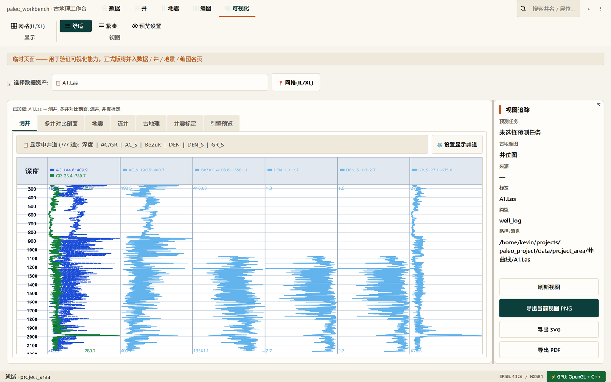
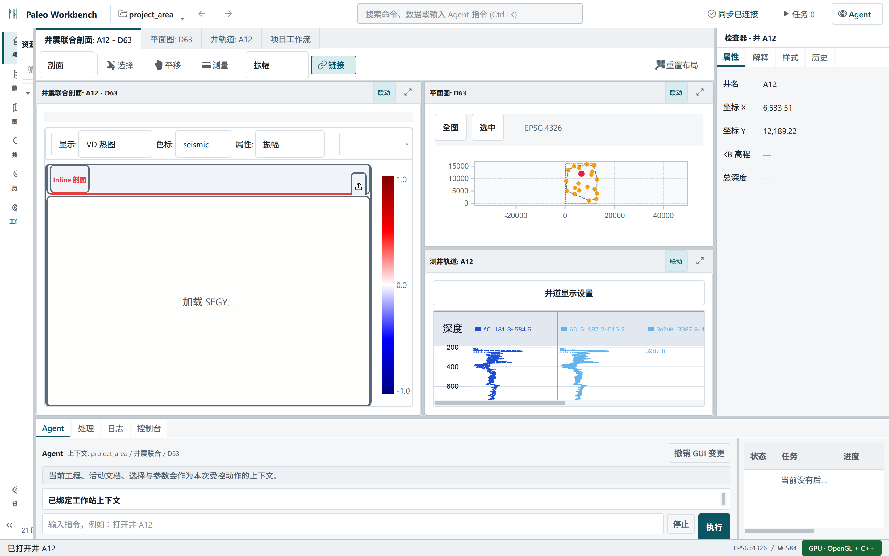

# Workstation V3 Light 设计与迁移规格

## 选定方向

选择候选 C：**IDE-style Geo Interpretation Workspace**，并根据评审改为白色背景。
视觉基准见 [reference/workstation-v3-light.png](reference/workstation-v3-light.png)。

## Before / After

| Before: page + Ribbon visualization | After: Workstation V3 Light |
|---|---|
|  |  |

这不是 Web Dashboard。实现限定为 PySide6 / Qt Widgets：`QSplitter`、`QTabBar`、
`QStackedWidget`、`QTreeView`、`QTabWidget`、model/view、现有 OpenGL/绘图 widgets。

## Design Tokens

| Token | Light | 用途 |
|---|---|---|
| `BG_HEADER` / `BG_SIDEBAR` | `#ffffff` | App bar、Explorer、Inspector、Process |
| `BG_BODY` | `#f4f6f8` | splitter 间隙和工作区结构底 |
| `BG_SEARCH` | `#edf1f4` | 输入、工具条、inactive tab、hover |
| `TEXT_PRIMARY` | `#18232d` | 主文本 |
| `TEXT_SECONDARY` | `#53616c` | 次要文本、图标 |
| `BORDER` | `#d6dde3` | 发丝分隔 |
| `BORDER_STRONG` | `#b8c3cc` | pane、区域边界 |
| `PRIMARY` | `#0b5563` | active、selection、link、primary action |
| `ACCENT` | `#a65313` | focus、processing、需要注意的活动状态 |
| `BG_SELECTION` | `#d8ebef` | tree/table selection |
| radius | 2/3/4px | 工具、输入、pane；不使用大圆角卡片 |

Dark 与 High Contrast 使用相同 semantic vocabulary 和相同几何结构。

## Typography 与密度

- 字体：Inter / PingFang SC / Microsoft YaHei UI / Segoe UI fallback。
- 正文 13px，面板标题 12-14px/700，次要与状态 11px，rail label 9px/600。
- 文档内部保持高信息密度；不按 viewport 宽度缩放字号。
- 控件默认高 28-30px，App Bar 46px，Document tab 32px，Status 26px。

## Panel 几何

- Activity Rail: 54px fixed。
- Explorer: 默认总左区 300px，允许折叠到 54px。
- Inspector: 默认 280px；窗口小于 1280px 自动隐藏，1320px 恢复。
- Process Hub: 默认 248px，可拖动。
- Linked workspace: Seismic/Section 至少 400px；Map/Well column 至少 300px。
- 所有尺寸由 `QSplitter` 管理并通过 `QSettings` 保存。

## 组件规范

### App Bar

只保留全局命令：Project menu、back/forward、Command/Agent input、link state、Task、Agent。
项目动作继续桥接现有 Ribbon signals；旧 Ribbon 高度为 0，作为迁移期命令兼容层。

### Explorer

Activity Rail 切换 Project/Data/Layers/Search/History/Workspaces 模式。Data 默认隐藏
`.preview_cache`、`meta.json`、`payload.npz`。Project tree 展示 Survey/Area、Well、Seismic、
Horizon、Interpretation、Result。Layer tree 明确提示移除图层不会删除数据。

### Document Host

统一使用文档 tabs。首批文档为井震联合、平面图、井轨道和兼容项目工作流。
联合文档使用水平/垂直 split，可单 pane 最大化、重置布局和链接选择。

### Context Bar

只显示活动文档所需的选择、平移、测量、显示属性、链接和重置布局。长尾命令进入
Command Palette；不会把 Well/Seismic/GIS/3D 的所有操作永久堆在 toolbar。

### Inspector

Properties / Interpretation / Style / History 四个固定 tab，内容由当前 Project、Well、
Resource、Horizon、Layer 动态生成。字段值使用可选取的 read-only editor，避免纯标签截断。

### Task 与 Agent

Task Center 直接轮询进程级 `TaskScheduler`，显示状态、标题、进度、用时、取消。
Agent 使用 `HarnessExecutor` 生成 typed plan，执行成功后发出 GUI action signals；失败时不改变
GUI。回执包含动作、校验结果和撤销入口。

## 模块适配策略

| 领域 | 首批适配 | 后续迁移 |
|---|---|---|
| GIS | `ProjectWellMapPage` 嵌入 Map pane | Mapping layer tree / layout / attribute adapters |
| Well | `WellLogCanvasPanel` 嵌入 Well pane | Correlation、Stratigraphy、Crossplot documents |
| Seismic | engine VD 2D profile 嵌入 Section pane | Horizon/Fault interpretation adapters |
| 3D | 保留独立重型 renderer/lazy lifecycle | 3D Document + scene Inspector |
| Plot | 现有 visualization/pyqtgraph | Plot Document + shared selection |
| Export/QC | 兼容工作流 | Layout/QC documents + task outputs |

联合首屏主动隐藏地震引擎的 3D renderer，只显示真实 VD 剖面。3D renderer 留在专用 3D
Document，避免在窄 pane 和远程 X11 环境中创建无效 OpenGL 首帧。

## 状态规范

- Empty：说明缺少的项目对象，并提供上下文动作，不显示假成功。
- Loading：进入 Task Center；活动 tab、对象和 pane 不因进度文字改变尺寸。
- Error：保留输入和参数，显示可定位日志与 Retry；不清空现有结果。
- Running：amber 仅用于过程状态，teal 仍表示 active/selected/link。
- Success：任务输出可打开到 Document，并在 Inspector 显示 provenance。

## 分阶段迁移

1. **Shell foundation（本 PR）**：App Bar、Explorer、Document Host、Inspector、Process Hub、tokens。
2. **Linked interpretation（本 PR）**：真实 Map/Well/2D Seismic、selection coordination、lazy views。
3. **Data/Layer contracts**：持久 Data 与文档 Layer adapter，拖入/移除/排序/样式。
4. **Interpretation documents**：Horizon/Fault/Correlation/Section 工具和 schema Inspector。
5. **3D/Plot/Layout**：专用 Document adapters，统一 tabs/splits/link groups。
6. **Legacy retirement**：逐页迁移测试通过后删除对应 Ribbon context 和 Hub wrapper。

## Acceptance Matrix

- 首屏以白色/冷灰为主，中心科学视图面积最大，没有 SaaS cards 或大圆角。
- Project/Data/Layer 三种对象范围清楚；Inspector 随选择变化。
- 井、地图、地震视图使用真实 Qt/engine widgets，支持 split/maximize/link。
- 长任务统一出现在 Task Center；Agent 成功动作能改变 GUI 状态。
- 旧页面和已有业务 signals 在迁移期保持可达。
- 1180x720 无关键文字重叠；1440x900 Explorer/Inspector/Process 均可读。
- 首屏 OpenGL renderer 不提前绘制；offscreen tests 不创建 native views。
